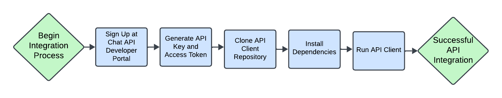

<html lang="en">
<head>
    <meta charset="UTF-8">
    <meta name="viewport" content="width=device-width, initial-scale=1.0">
    <title>Getting Started - Real-Time Chat API Documentation</title>
    <link rel="stylesheet" href="../styles.css">
    <!-- Correct CSS file path -->
</head>
<body>
  <!-- Navigation Menu -->
    <nav class="horizontal-menu">
        <a href="../index.html">Introduction</a>
        <a href="getting-started.html" class="active">Getting Started</a>
        <a href="endpoints.html">Endpoints</a>
        <a href="../examples/integration-examples.html">Integration Examples</a>
        <a href="troubleshooting.html">Troubleshooting</a>
    </nav>
   <!-- Main Content -->
    <main class="content">
        <h2>Getting Started</h2>
        
Welcome to the Real-Time Chat API! This guide will help you set up and integrate the API into your project quickly.

 

 <h3>Integration Flow</h3>
        
Below is a visual representation of the integration process:

        

 <h3>Prerequisites</h3>
        <ul>
            <li><strong>API Key and Access Token:</strong> Obtain your API credentials by signing up at <a href="https://example.com">Chat API Developer Portal</a>.</li>
            <li><strong>Development Environment:</strong> Node.js (v14+ recommended) and a modern browser or Postman for testing endpoints.</li>
        </ul>

 <h3>Installation</h3>
        <ol>
            <li>Clone the API client repository:
                <pre><code>git clone https://github.com/your-repository-name/chat-api-client.git
cd chat-api-client</code></pre>
            </li>
            <li>Install Dependencies:
                <pre><code>npm install</code></pre>
            </li>
            <li>Run the Client:
                <pre><code>node index.js</code></pre>
            </li>
        </ol>
  

 <h3>Example Usage</h3>
        
Here's how you can set up the client with your API credentials:

        <pre><code>const chatClient = require('chat-api-client');

const client = new chatClient({
  apiKey: 'your-api-key',
  accessToken: 'your-access-token',
});

client.connect()
  .then(() => console.log('Connected to the Real-Time Chat API'))
  .catch(err => console.error('Connection failed:', err));
</code></pre>

 <h3>Troubleshooting</h3>
        
Here are some common issues and their solutions:

        <ul>
            <li><strong>Invalid API Credentials:</strong> Ensure your API key and access token are correct. Double-check your credentials in the <a href="https://example.com">Chat API Developer Portal</a>.</li>
            <li><strong>Connection Errors:</strong> Verify your network connection and check that the API service is up and running.</li>
        </ul>

For additional support, visit the <a href="https://example.com/support">API Support Page</a>.

    </main>
<!-- Footer -->
    <footer>
        
© 2025 Gianpiero Fiorino. All rights reserved. | <a href="https://gfiorino.github.io/Technical-Writing-Portfolio/">Back to Portfolio</a>

    </footer>
</body>
</html>
